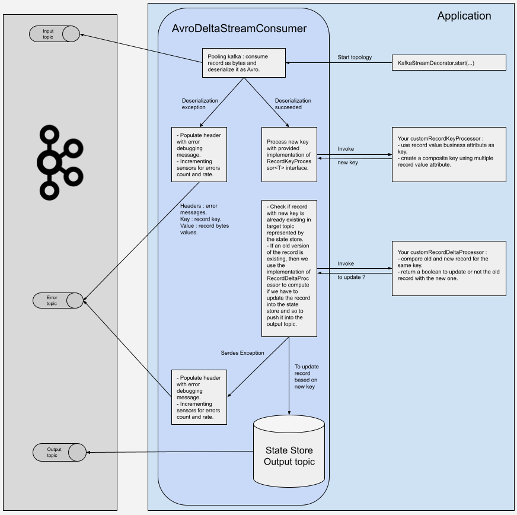

[](https://opensource.org/licenses/Apache-2.0)
# Maston


Open source java project providing simple kafka streams tools using Vavr.

The purpose to this project it to provide easy tools and features for java developers new to Kafka ecosystem. This project combines the following APIs:
* Kafka Streams from Apache https://kafka.apache.org/documentation/streams/
* Confluent.io https://github.com/confluentinc
* Vavr https://github.com/vavr-io/vavr

## Table of Contents
- [Summary](#summary)
- [Run](#run)
- [Start Stream](#start-stream)
    - [SimpleAvroStreamConsumer](#simpleavrostreamconsumer)
    - [AvroDeltaStreamConsumer](#avrodeltastreamconsumer)
- [Error Handling](#error-handling)
- [Easy Properties Builder](#easy-properties-builder)
- [Metrics](#metrics)
- [Avro BigDecimal Mapper](#avro-bigdecimal-mapper)
- [Testcontainer and IT](#testcontainer-and-it)

## Summary
It provides the following features responding to business cases we encountered through some client missions:
* `SimpleAvroStreamConsumer` => a simple consumer based on Apache kafka-streams DSL and API Processor to use there turnkey producer/consumer wrappers combined with Vavr Java extended language to handle gracefully errors, metrics and logging.
* `AvroDeltaStreamConsumer` => a consumer derived from `SimpleAvroStreamConsumer` to add a delta computing between two records with the same key. It also allows to compute a new key for the consumed record. 
* NB : you can use https://zz85.github.io/kafka-streamss-viz/ to visualize previous topologies for a better understanding.

... some easy tools to wrap more complex features from kafka-streams:
* `KafkaStreamsDecorator` => a decorator to safely start a kafka stream.
* `serdes` => several safe Serializers/Deserializers for JSON and Avro formats.
* `properties` => properties classes which can directly be used to inject properties from yaml/properties files to kafka-streams. `KafkaPropertiesBuilder`also contained default and recommended properties from Apache kafka-streams and Confluent.io documentations. 
* `MetricsBuilder` => simple sensor to record error count and rate.
* `interceptor` => interceptors to log produced/consumed records.
* `error` => error handling tools to populate header with error debugging messages. `HeaderTo` must be used into Kafka-Connect transformers.
* `AvroByteBufferToBigDecimalMapper` => mapper to read bytes from Avro record and maps them to BigDecimal.

... and some testing tools examples :
* `it` => Integration Tests using Testcontainers https://www.testcontainers.org/
* `topology` => Unit Tests using `TopologyTestDriver`


# Run

Prerequisites :
* jdk 8
* maven 3 or more.
* a running docker daemon if you want to run the integration tests.

To build the jar, simply run :
`mvn clean install` 

# Start Stream

`KafkaStreamsDecorator` provides a complete clean way of starting a topology.

## SimpleAvroStreamConsumer

### Topology Schema


### Example

See test example in `src/test/java/fr/barbicane/maston/topology/SimpleVavrStreamConsumerTopologyTest.java`

## AvroDeltaStreamConsumer

### Topology Schema



### Example

See test example in `src/test/java/fr/barbicane/maston/topology/VavrKStreamWithDeltaTopologyTest`

# Error Handling

The following error handling system is inspired from dead letter queue. You can read more about dead letter queue on https://docs.confluent.io/cloud/current/connectors/dead-letter-queue.html

Purpose : simply catch all kind of Exception and handle all type of business Error to push the linked record to an error topic with debugging information into the record headers. **This mechanism was designed in order to never lost a record !** Indeed, as exception/error is handled trough kafka-streams DSL and processor API context, we let these APIs manage the kafka transaction for us, such as we tend to be in an exactly-one semantic 🤓

We defined several error codes in `KafkaErrorToHeaderBuilder`. These codes are associated to an error message to debug.

A common way to read errors from an error topic is to use a kafka-connect-*-sink connector to consume these errors and pushes it to reporting/monitoring system such as an ELK or a Prometheus. To do so, we also add the following feature:
* `HeaderTo` is a Kafka Connect Transformers.
* Some documentation about Kafka Connect custom Transformers : https://docs.confluent.io/platform/current/connect/transforms/custom.html
* `HeaderTo` is directly derived from https://cwiki.apache.org/confluence/display/KAFKA/KIP-145+-+Expose+Record+Headers+in+Kafka+Connect

Here an example of `HeaderTo` transformers used in a kafka connect `io.confluent.connect.elasticsearch.ElasticsearchSinkConnector` plugged on an error topic containing error records pushed by **Maston** on a real production project :

```
transforms=addPrefix,insertTimestamp,convertTimestamp,headersToFields

transforms.addPrefix.type=org.apache.kafka.connect.transforms.RegexRouter
transforms.addPrefix.regex=.*
transforms.addPrefix.replacement=kafka-$0

transforms.insertTimestamp.type=org.apache.kafka.connect.transforms.InsertField$Value
transforms.insertTimestamp.timestamp.field=@timestamp

transforms.convertTimestamp.type=org.apache.kafka.connect.transforms.TimestampConverter$Value
transforms.convertTimestamp.field=@timestamp
transforms.convertTimestamp.format=yyyy-MM-dd'T'HH:mm:ss.SSSZ
transforms.convertTimestamp.target.type=Timestamp

transforms.headersToFields.type=fr.barbicane.maston.error.HeaderTo$Value
```

The result in Kibana (blank error fields have been anonymized):


# Easy Properties Builder

`KafkaPropertiesBuilder` provides a simple way of building default kafka-streams configurations with some bundled features :
* recommended configurations from https://docs.confluent.io/current/cloud/cp-component/streams-cloud-config.html
* number of Stream thread lock to 1: we chose to keep one stream thread by running application in order to kill and restart the application in the case of Runtime exception killing the thread. This is really suitable for cluster deployment with managed solution such as Kubernetes => the pod is killed and restarted if the stream thread is killed.
* topology optimisation https://docs.confluent.io/platform/current/streams/developer-guide/optimizing-streams.html
* `JmxReporter` is enabled for Jmx exposition.
* `fr.barbicane.maston.interceptor` logging level and activation.
* kafka common properties and consumer properties classes.
  
`KafkaCommonProperties` and `KafkaConsumerProperties` can easily be bound to a yaml properties file as following:

yaml file ...
```
kafka:
  common:
    bootstrap-servers: ${bootstrap-servers}
    schema-registry-url: ${schema-registry-url}
    security-protocol: SASL_SSL
    basic-auth-credentials-source: USER_INFO
    schema-auto-register: false
    schema-registry-basic-auth-user-info: ${schema-registry-basic-auth-user-info}
    sasl-mechanism: PLAIN
    sasl-jaas-config: ${secret.kafka.sasl-jaas-config}
    ssl-endpoint-identification-algorithm: https
    enabled-default-consumer-interceptor: false
    application-id: ${}
  consumer:
    your-topic-domain:
      topic: ${input-topic}
      error-topic: ${error-topic}
```

bound and injected with for example Spring

```
  @Bean
  @ConfigurationProperties(prefix = "kafka.common")
  public KafkaCommonProperties kafkaCommonProperties() {
    return new KafkaCommonProperties();
  }
  
  @Bean("kafkaConsumerProperties")
  @ConfigurationProperties(prefix = "kafka.consumer")
  public KafkaConsumerProperties kafkaConsumerProperties() {
    return new KafkaConsumerProperties();
  }
```

# Metrics

As said in previous section, we enabled by default the `JmxReporter` provided by kafka-streams in order to expose metrics for application monitoring => application lag and so on.

Moreover, we added custom `Sensor` in the `MetricsBuilder`. This sensor provides an error count and rate used in the `SimpleAvroStreamConsumer` and `AvroDeltaStreamConsumer`. Here an example of metrics exposed through the Jmx API and watched with JConsole : 


# Avro BigDecimal Mapper

`AvroByteBufferToBigDecimalMapper` can be used to deserialized bytes from Avro record to java `BigDecimal` :

```
private final AvroByteBufferToBigDecimalMapper byteBufferToBigDecimalMapper = new AvroByteBufferToBigDecimalMapper();

final BigDecimal bigDecimalFromAvroBytes = byteBufferToBigDecimalMapper.apply(recordInstance.getBigDecimalAsBytes(), RecordAvroClass.getClassSchema(), "BigDecimalAsBytes");
```


# Testcontainer and IT

We used Testcontainer to run some integration tests. Here the key features to be noticed : 

### Docker-compose

We started a Kafka cluster with a Schema Registry, and a Zookeeper defined in `src/test/resources/docker-compose.test.yml` by using : 

```
  @ClassRule
  public static DockerComposeContainer environment =
      new DockerComposeContainer(
          new File(SimpleVavrStreamConsumerIT.class.getClassLoader().getResource("docker-compose.test.yml").getFile()))
          .withLocalCompose(true)
          .withExposedService("zookeeper_1", 2181)
          .withExposedService("kafka_1", 9092)
          .waitingFor("schema-registry_1", Wait.forHttp("/subjects").forStatusCode(200));
```

### Topic Creation

Here the piece of code found on the Internet, we used for topic creation:

```
  protected void createTopic(String topicName) {
    String createTopic =
        String.format(
            "/usr/bin/kafka-topics --create --zookeeper zookeeper:2181 --replication-factor 1 --partitions 1 --topic %s",
            topicName);
    try {
      ContainerState kafka = (ContainerState) environment.getContainerByServiceName("kafka_1").get();
      Container.ExecResult execResult = kafka.execInContainer("/bin/sh", "-c", createTopic);
        if (execResult.getExitCode() != 0) {
            fail();
        }
    } catch (Exception e) {
      e.printStackTrace();
      fail();
    }
  }
```

### State Store

To run integration tests with State Store, we created temp directory for the state store in order to isolate each integration tests (and obviously unit tests to be unit 🤗 !):

```
  static {
    try {
      STATE_STORE_DIR = Files.createTempDirectory("maston-kafka-streams-intregration-test").toAbsolutePath().toString();
    } catch (IOException e) {
      LOGGER.error("Error while creating temp directory for it tests", e);
      throw new RuntimeException(e);
    }
  }
```